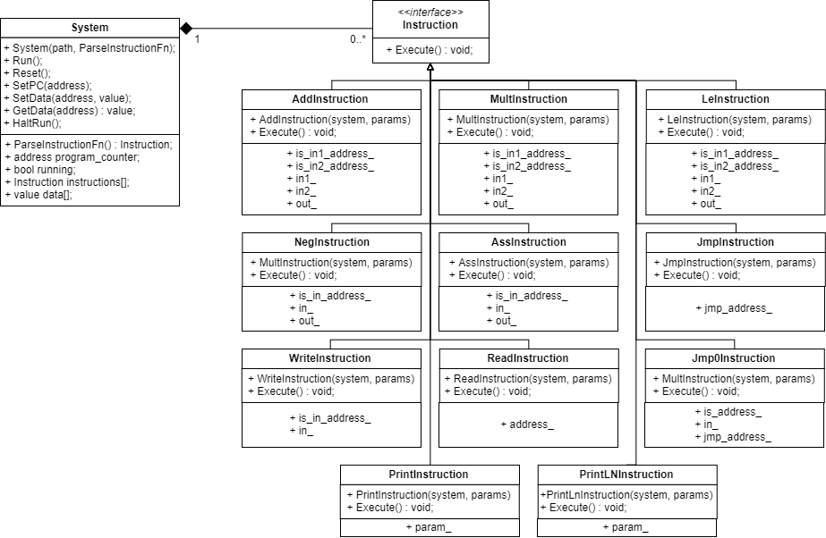

# OOP-SIM

## About

Developed by Karim Abdel Hamid, of the American University of Cairo, for my Object Oriented Programming Course. My ID is 900143463. Developed under the supervision of Dr. Sherif Kassas.

## Building

Use CMake to create a project, using `cmake .` in the root directory.
Use the attached makefile to create the project on UNIX systems, using `make` in the root directory.

## Running

Simply run the executable, either with a test file indicated, or by input the file after startup.

## Class Diagram

This isa  class diagram for the project, developed using Draw.IO.
